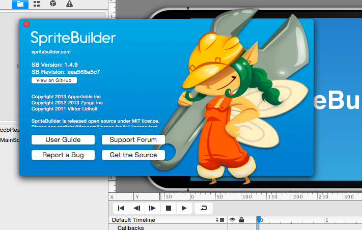
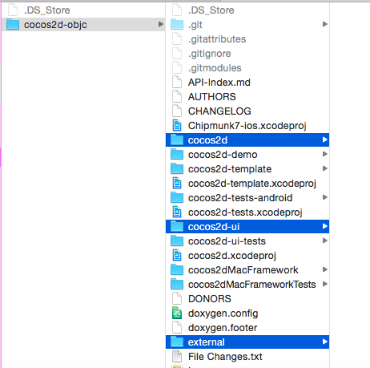
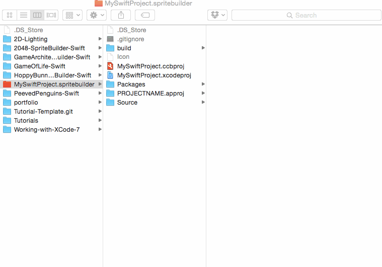
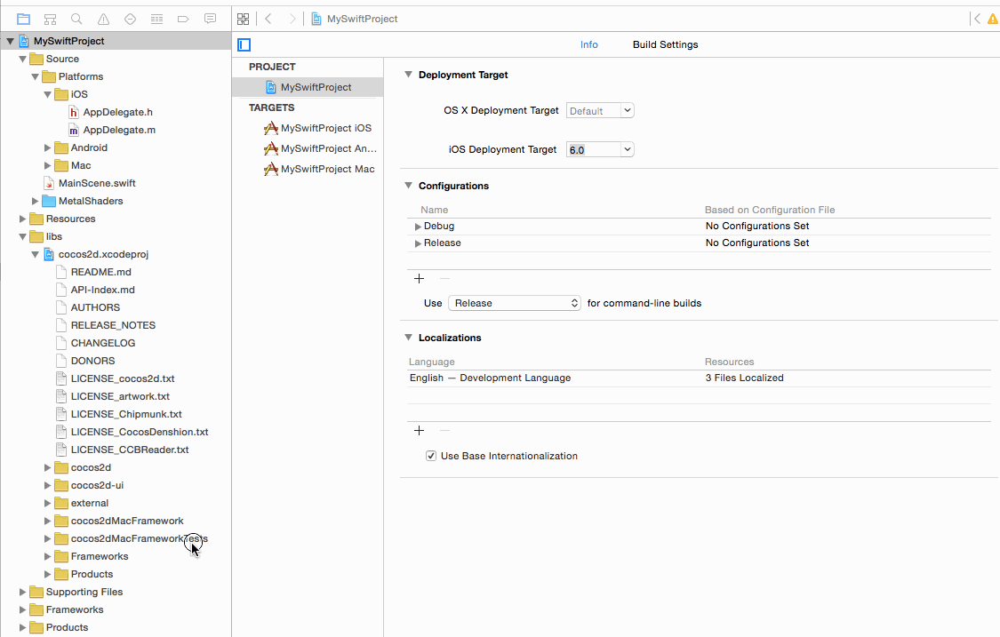

Apple's release of Xcode 7 brings Swift 2 and support for the latest versions of each of its platforms.  Cocos2D is still getting updates to stay compatible with Apple's changes.  Unfortunately, SpriteBuilder has not been updated recently and may not be updated much in the near future.  While it is still functional it will no longer deliver updates to Cocos2D.  This tutorial will cover how to do this process yourself.

#Getting Started

Let's go through the steps required to bring a project up to the latest version of Cocos2D.  We'll start from the very beginning, from a brand new project created from SpriteBuilder.  If you are updating an existing project, I suggest trying it with a fresh project first.  

We need two tools to create a new project with Cocos2D.  The first is Xcode 7, of course.  Its available on the [app store](https://itunes.apple.com/us/app/xcode/id497799835?mt=12).  Second, SpriteBuilder is an open source tool that streamlines content creation and works with Cocos2D.  SpriteBuilder can be downloaded from the [app store](https://itunes.apple.com/us/app/spritebuilder/id784912885?mt=12) or from [www.spritebuilder.com](http://www.spritebuilder.com).  If you have SpriteBuilder already, verify it is the latest version (1.4.9). 

With these tools we can begin.  Create a new project in SpriteBuilder, and publish it.

#Update Cocos2D

Now that we have a project, we can go ahead and update the version of Cocos2D it is using.  Rather than rely on SpriteBuilder to perform the update, we'll do it manually.  To get the most up to date version, download the project straight from its repository located [here](https://github.com/cocos2d/cocos2d-objc).  If you want to clone the repository from the command line, the command is:

	git clone --recursive https://github.com/cocos2d/cocos2d-objc.git

This will download the latest version of Cocos2D (and its dependencies).  Now to update the project.  Navigate to the new version and copy three folders: cocos2d, cocos2d-ui and external.

> [info]
> You can hold command (⌘) to select multiple folders at once.

These three folders contain the changes that need to be moved into the project.  The next part is finding the location of Cocos2D in your project.  It's located in the folder named "cocos2d-iphone" inside the project.  Pasting the new folders will prompt a warning that you are trying to replace folders that exist already.  No files or subfolders were renamed, so doing this OK.  It won't break anything.

With the new folders in place, we can move over and tie things up in XCode.  

#Cleanup and Build

Now that the source has been updated, its time to make sure there are no problems building the project.  Open the project with Xcode.  The last change before the project is ready is to check the deployment target for the project and each subproject.  Make sure that each project is set to target at least iOS 8.0.  Change any project that targets earlier than this.

We're nearly finished with the update.  Last task is to clean the project and build folder.  Cleaning the project is easy enough, its right in the "Product" drop down menu.  Finding the "Clean Build Folder..." function can be tricky if you don't know where to look.  Its revealed by holding the option key (⌥) while selecting the "Product" drop down.

Now with no trace of the previous version we are ready to build the project.  This will take a moment, but should be successful.  There may be some new or unusual warnings.  They will be cleared up in future releases of Cocos2D.

#Summary

Although it is sad that SpriteBuilder won't be supported for the near future, you now can update Cocos2D when changes are announced.  It is a three step process: download the latest changes from the [Cocos2D repository](https://github.com/cocos2d/cocos2d-objc), copy three folders into the existing project, and clean both the project and build folders.  This process should continue to work for future versions of Cocos2D up to a major version change.  Happy coding!